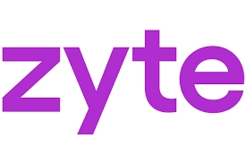

# 2025年最值得用的免费网页抓取工具大盘点

如今，找到合适的数据抓取工具已经成为许多行业的刚需——无论你是做学术研究、竞品分析、电商运营还是市场营销。好消息是，2025年的免费工具已经强大到令人惊讶，完全可以满足大部分人的需求。

这篇文章会带你看看那些真正好用的免费抓取工具。不玩虚的，只讲实用的。看完你就知道该用哪个了。

---

## 这些工具到底怎么工作的？

说白了，网页抓取工具就是帮你自动从网站上"搬运"数据的助手。它会向目标网页发送请求，然后分析HTML代码，把你要的信息（文字、图片、结构化数据）给抓出来。

有些高级工具还能运行JavaScript，抓取那些动态加载的内容。像[Octoparse](https://www.octoparse.fr/)这种工具，还能帮你过滤、整理数据，最后导出成CSV或JSON格式，直接拿去用。

## 怎么选一个靠谱的工具？

市面上工具一大堆，选起来确实让人头疼。但抓住几个关键点，就不会踩坑：

🔹 **系统兼容性**：大多数工具支持Windows，但如果你用Mac或Linux，一定要先确认能不能用。

🔹 **云服务**：想抓大量数据或者让程序自动跑？那云服务是必须的，省得你24小时开着电脑。

🔹 **数据对接能力**：抓完数据要干嘛？选个能无缝对接其他工具的，才能真正提高效率。

🔹 **学习成本**：不会编程也没关系，选那种有教程、有客服的工具，上手快。

🔹 **价格**：预算永远是大事。免费的能搞定就别花冤枉钱，付费的也要看性价比。

## 2025年最好用的工具清单

### 一、图形界面工具（不用写代码）

#### 1. Octoparse

Octoparse是目前最友好的可视化抓取工具，用AI自动识别页面结构。就算你完全不懂编程，也能轻松上手。

它有个智能检测模式，能自动分析网页，你只需要点点鼠标就能设置抓取规则。更厉害的是，它提供了很多预设模板，针对热门网站（比如电商平台、社交媒体）可以直接用，连设置都省了。

**核心优势：**
- 一键转换网页数据到Excel、CSV或Google Sheets
- 自动识别网页结构，零代码操作
- 内置热门网站模板，点击即用
- 智能避开IP封锁
- 云端定时抓取

平均每个页面只需6.5秒就能完成数据提取。而且它的模板可以在线直接用，连软件都不用下载。比如这个联系方式抓取模板，非常实用：
https://www.octoparse.fr/template/contact-details-scraper

**价格**：14天免费试用，标准版69美元/月起

#### 2. ParseHub

ParseHub能应对复杂的动态网站，支持JavaScript和AJAX加载的内容。它的工作流配置界面很清晰，数据可以直接导出为JSON或CSV。

**优点**：跨平台支持，客服响应快，导出方便  
**缺点**：免费版有限制，高级功能需要学习

**价格**：免费版支持5个公开项目，付费版189美元/月起

#### 3. Mozenda

这是一个面向企业的专业级工具，自动化程度很高，还有API连接器。不过界面有点老派，更适合大公司用。

**优点**：客服专业，流程可定制  
**缺点**：价格偏高，界面不够现代

**价格**：99美元/月起

#### 4. Import.io

Import.io是个完整的SaaS解决方案，特别适合电商领域的大规模数据采集。它的数据清洗和结构化功能非常强。

**优点**：API集成深度好，支持实时大规模采集  
**缺点**：费用高，技术门槛不低

**价格**：299美元/月起

### 二、API平台（适合技术流）

#### 1. Apify

Apify是个云平台，可以运行自定义的抓取机器人（actors）。灵活性极强，适合需要深度集成和自动化的场景。

**优点**：社区活跃，文档详细，API功能完整  
**缺点**：复杂场景需要掌握高级JavaScript

**价格**：免费版有限制，付费版39美元/月起

#### 2. Zyte

Zyte提供了完整的工具生态，包括AutoExtract和Splash，特别擅长处理动态页面并转换为JSON数据。

**优点**：API稳定，可扩展性强，社区支持好  
**缺点**：用量大了费用会涨得快，需要一定技术基础

**价格**：1000次请求内免费，付费版450美元/月起

#### 3. ScraperAPI

👉 [ScraperAPI](https://www.scraperapi.com/?fp_ref=coupons)是个专注于规避反爬机制的云服务，自动处理IP轮换和代理，避免被网站封锁。

**优点**：完美处理验证码、重定向和JavaScript，API超级简单  
**缺点**：高频使用成本会上升，不适合不需要代理轮换的场景

**价格**：49美元/月起，按请求量计费  
**免费试用**：5000次请求

#### 4. ScrapingBot

ScrapingBot专注实时数据采集，支持各种来源包括社交媒体和应用。

**优点**：每月积分额度慷慨，有专门的房产和电商API，支持JavaScript  
**缺点**：没有完整的免费试用，界面对新手不够友好

**价格**：免费版500积分，付费版22-171欧元/月

#### 5. Scrape Owl

灵活易用的RESTful API抓取服务。

**优点**：支持JavaScript、AJAX，多种输出格式，集成简单  
**缺点**：基础套餐功能有限，文档有待完善

**价格**：29美元/月起

### 三、浏览器插件（快速上手）

**Chat4Data**：用对话方式就能采集数据，AI自动识别你要的信息——文字、图片、链接、邮箱、电话，都能搞定。

**Web Scraper**：超受欢迎的Chrome插件，通过配置sitemap来自动化抓取，还支持云端模式。

**Data Scraper**：兼容Chrome和Firefox，几次点击就能抓表格和列表，零基础也能用。

**Instant Data Scraper**：最简单的Chrome插件，几秒钟就能复制网页数据，适合临时快速抓取。

### 四、开发者工具（硬核玩家专属）

**Python（BeautifulSoup、Selenium、Playwright）**：程序员的首选，灵活性无敌，适合复杂的自定义任务。

**Scrapy 2.0**：强大的Python框架，专为大规模抓取设计，模块化架构处理复杂页面毫不费力。

**Node.js（Puppeteer）**：处理动态网站的利器，能模拟完整浏览器环境，抓JavaScript渲染的内容很在行。

**Jupyter Notebooks**：用来快速测试Python抓取脚本的理想环境，边写边看效果。

### 五、高级解决方案

**Dexi.io**：面向高级用户，提供三种机器人类型：Extractor、Crawler和Pipes。功能强大但有学习曲线。

**Webhose.io**：实时获取全球在线数据源，支持多语言和暗网抓取，可导出XML、JSON、RSS格式。

**Common Crawl**：巨型在线资源库，包含数十亿网页。适合需要超大规模分析的研究项目。

---

## 总结一下

网页抓取已经成为很多行业的标配技能，能大幅提升工作效率。2025年的工具生态已经非常成熟，无论你是技术小白还是编程高手，都能找到适合自己的方案。

关键是明确自己的需求：抓取量有多大？需不需要云服务？会不会编程？预算多少？搞清楚这几个问题，选工具就容易多了。

如果你想从零开始学习网页抓取，又不想碰代码，那就试试👉 [ScraperAPI](https://www.scraperapi.com/?fp_ref=coupons)这类自动化服务——它能帮你绕过大部分技术障碍，让你专注在数据本身。毕竟，数据才是最终目的，工具只是手段。
